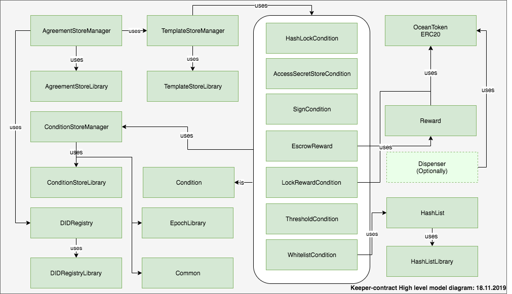

# Keeper Contracts Documentation
A high level keeper contracts diagram model:

## File Structure

There are several folders and each includes solidity source files for each module:

* **Contracts Documentation**
    - [Agreements](#)
        - [Agreement Store Manager](AgreementStoreManager.md)
        - [Agreement Store Library](AgreementStoreLibrary.md)
    - [Templates](#)
        - [Template Store Manager](TemplateStoreManager.md)
        - [Template Store Library](TemplateStoreLibrary.md)    
        - [Agreement Template (DEPRECATED)](AgreementTemplate.md)
        - [Escrow Access Secret Store Template (DEPRECATED)](EscrowAccessSecretStoreTemplate.md)
        - [Escrow Compute Execution Template (DEPRECATED)](EscrowComputeExecutionTemplate.mds)
    - [Conditions](#)
        - [Condition Store Manager](ConditionStoreManager.md)
        - [Condition Store Library](ConditionStoreLibrary.md)
        - [Condition Base Contract](Condition.md)
        - [Hash Lock Condition](HashLockCondition.md)
        - [Lock Reward Condition](LockRewardCondition.md)
        - [Sign Condition](SignCondition.md)
        - [Access Secret Store Condition](AccessSecretStoreCondition.md)
        - [Whitelisting Condition](WhitelistingCondition.md)
        - [Threshold Condition](ThresholdCondition.md)
        - [Compute Execution Condition](ComputeExecutionCondition.md)
        - [Rewards](#)
            - [Reward](Reward.md)
            - [Escrow Reward](EscrowReward.md)
    - [Libraries](#)
        - [EpochLibrary](EpochLibrary.md)
        - [HashListLibrary](HashListLibrary.md)
    - [Token](#)
        - [Ocean Token](OceanToken.md)
        - [Dispenser](Dispenser.md)
    - [Interfaces](#)
        - [ISecret Store](ISecretStore.md)
    - [Registry](#)
        - [DID Registry](DIDRegistry.md)
        - [DIDRegistry Library](DIDRegistryLibrary.md)
    - [Common](Common.md)
    - [Hash List](HashList.md)
